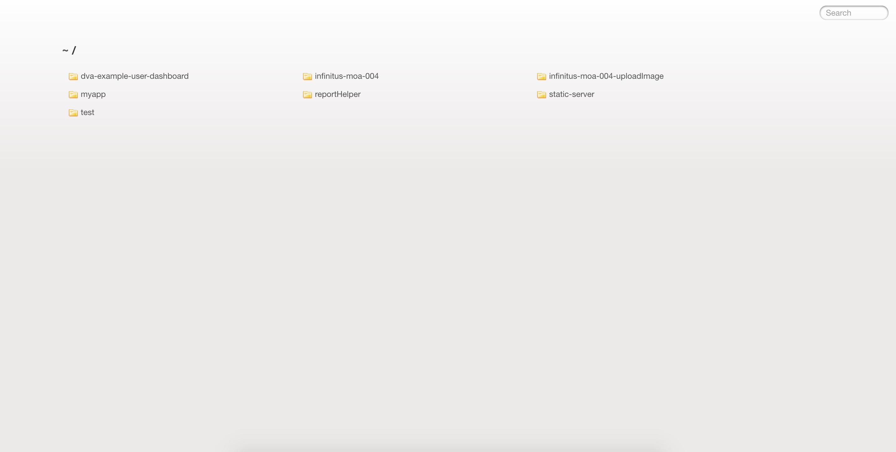

# 说明

这项目用于当做静态服务器,同时支持配置代理

## 使用

```
# 进入到需要提供静态服务的文件夹
git clone https://github.com/kunzhijia/static-server.git
cd static-server
npm install
npm start //服务器器支持热加载，修改app.js 不需要重启服务器
open http://localhost:3000
```
启动之后访问对应路径的页面即可。

页面效果



## 配置代理

代理的配置在 `app.js` 文件

简单配置

```
// http://localhost:3000/infinitus-moa-store/store/getStoreImproveList.action -> http://192.168.14.168:8080/infinitus-moa-store/store/getStoreImproveList.action
app.use('/infinitus-moa-store', proxy({target: 'http://192.168.14.168:8080', changeOrigin: true}));

//支持配置多个
app.use('/api1', proxy({target: 'http://www.example.org', changeOrigin: true}));
app.use('/api2', proxy({target: 'http://www.example.org2', changeOrigin: true}));
```

代理使用的[http-proxy-middleware](https://github.com/chimurai/http-proxy-middleware),更复杂的需求可以查看其文档。
